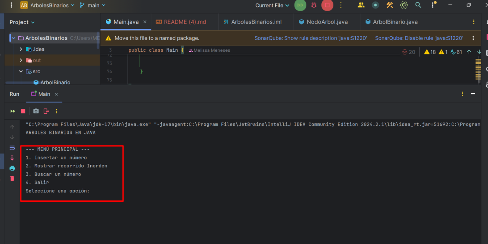
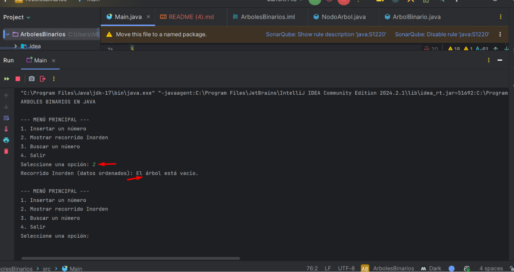
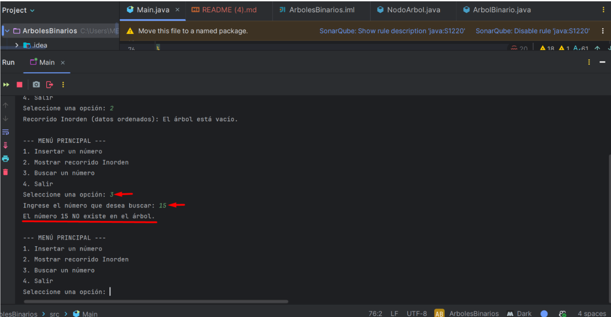
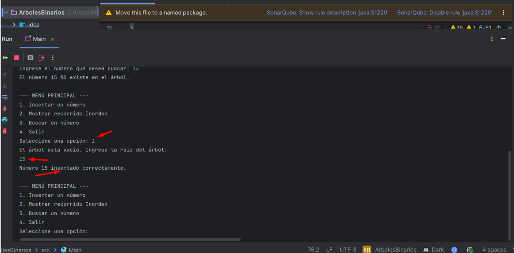
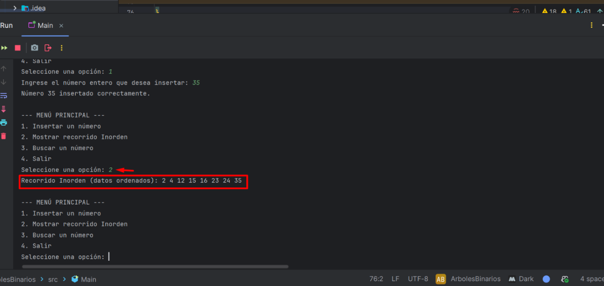
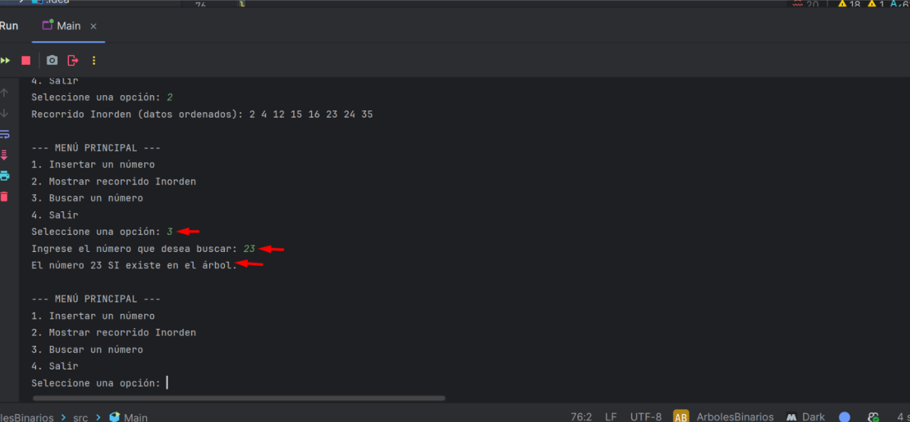
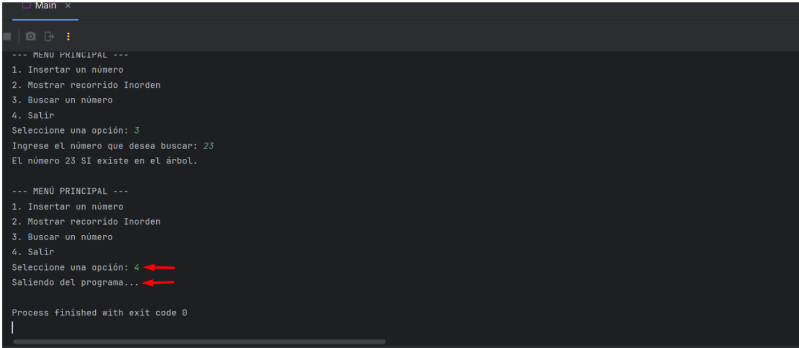

# 🌳 ÁRBOLES - Simulador de Estructura Binaria (ABB)

Este proyecto es una aplicación de consola desarrollada en **Java** que permite comprender y visualizar el comportamiento de un **Árbol Binario de Búsqueda (ABB)**, una estructura de datos jerárquica que organiza los datos de forma eficiente.

## 🎯 Objetivo del Proyecto

El programa demuestra el uso de nodos y recursividad para gestionar una estructura de árbol:

1.  **Insertar Números:** Ubica los datos siguiendo la regla de los ABB (menores a la izquierda, mayores a la derecha). El programa solicita definir la **Raíz** si el árbol está vacío.
2.  **Recorrido Inorden:** Procesa los nodos para mostrar la lista de elementos de forma ordenada (ascendente).
3.  **Búsqueda:** Implementa un algoritmo de búsqueda para verificar la existencia de un valor.

## 🚀 Instrucciones de Ejecución

### Requisitos previos

* Tener instalado el **JDK (Java Development Kit)** versión 8 o superior.
* Un IDE (IntelliJ IDEA, Eclipse, NetBeans) o la terminal de comandos.

### Pasos para ejecutar

1.  **Clonar el repositorio:**
    ```bash
    git clone [https://github.com/TuUsuario/ArbolesBinariosJava.git](https://github.com/TuUsuario/ArbolesBinariosJava.git)
    ```

2.  **Compilar el programa:**
    ```bash
    javac src/*.java
    ```

3.  **Ejecutar:**
    ```bash
    java Main
    ```

## 🛠️ Estructura del Código

* `Main.java`: Contiene el menú interactivo, la lógica de control y el algoritmo de **impresión visual vertical**.
* `ArbolBinario.java`: Implementación de la lógica de la estructura (insertar, buscar, inorden).
* `NodoArbol.java`: Definición de la unidad básica del árbol con sus punteros hacia los hijos.

## 📸 Capturas de Pantalla

*(Nota: Sustituya los archivos `img.png` con las capturas reales de la ejecución de su programa en la carpeta raíz).*







Proyecto desarrollado por:

* **[Melissa Meneses Acevedo]** - [https://github.com/meli0720]
---
*Este proyecto fue realizado para la asignatura de Estructuras de Datos.*